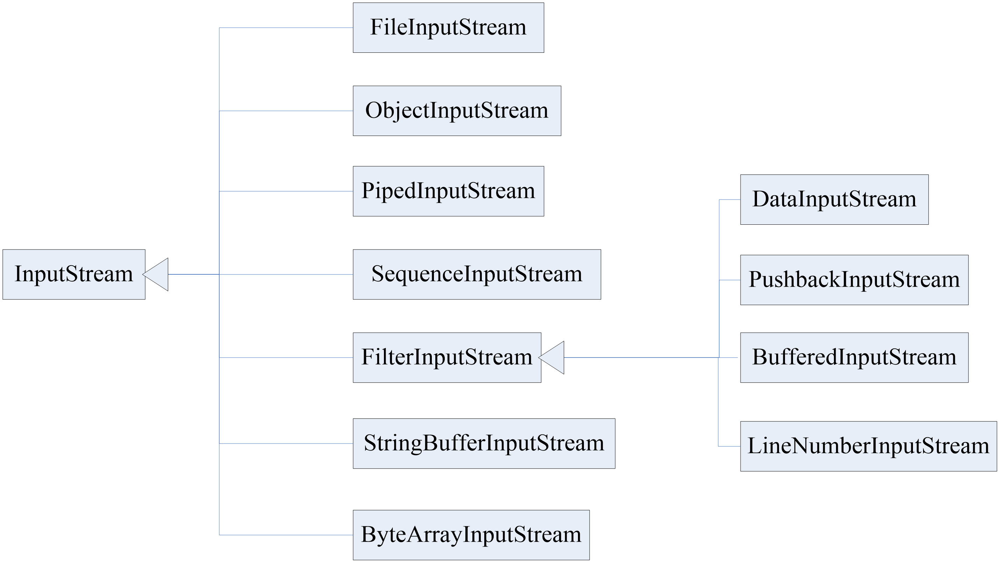

#I/O流

## 目标
> 1.了解输入输出的基本概念

> 2.掌握常见io类的用法

> 3.了解序列化的相关知识
> > 数据对象的序列化
>
> > 序列化数据对象读写

## 内容
### 字节输入流与输出流
#### 流的意义
> 流的概念使得文件、网络、内存等设备可以被统一处理
#### 字节输入流类

### 字符输入流与输出流
### 其他数据类型输入输出
### 文件（File）
